# Qubik: A Python Container Orchestrator  

## 📚 Table of Contents
- [Project Overview](#-project-overview)
- [Technical Implementation](#-technical-implementation)
  - [Core Features](#core-features)
  - [Current Limitations](#current-limitations)
- [Key Features](#-key-features)
- [System Architecture](#-system-architecture)
- [Task Lifecycle](#-task-lifecycle)
- [Component Interactions](#-component-interactions)
- [API Endpoints](#-api-endpoints)
- [Future Considerations](#-future-considerations)
- [Getting Started](#-getting-started)
- [License](#-license)

## 📖 Project Overview  

Qubik is an **educational Python implementation** of core container orchestration concepts, inspired by Tim Boring's ["Build an Orchestrator in Go From Scratch"](https://www.manning.com/books/build-an-orchestrator-in-go-from-scratch). While initially following the book's architectural patterns, the project later diverges significantly—particularly in worker-manager interaction logic. Key differences stem from Python-specific implementations and the absence of Go routines.  

## 🧠 Technical Implementation  

### Core Features  
- **Round-Robin Scheduling**: Basic rotation algorithm (non-resource-aware)  
- **Async Design**: Built with Python's `asyncio` for concurrency  
- **Docker Integration**: Uses the [Docker Engine SDK](https://docs.docker.com/reference/api/engine/sdk/) for container operations   

### Current Limitations  
- **Basic Scheduling**: No E-PVM or advanced algorithms  
- **Stateless**: In-memory operation (no persistence layer)  
- **Minimal Recovery**: No automatic task rescheduling or failure handling
- **API-Only**: No CLI interface (yet)  

## 🌟 Key Features

1. **Basic Orchestration**:
   - Manager-worker architecture
   - Container lifecycle management
   - Round-robin task distribution

2. **Asynchronous Components**:
   - FastAPI for REST endpoints
   - Async HTTP client for inter-service communication
   - Background metric collection

3. **Monitoring**:
   - Real-time CPU/memory/disk metrics
   - Task state tracking
   - Worker health monitoring

## 🏗️ System Architecture

```mermaid
flowchart TD
    subgraph Manager["Manager Node"]
        MA[Manager API]
        S[RoundRobin Scheduler]
        TM[Task Manager]
        
        MA -->|HTTP| TM
        TM -->|Queue| S
        S -->|Assign| W1
        S -->|Assign| W2
    end

    subgraph Worker["Worker Node"]
        WAPI[Worker API]
        Q[Async Task Queue]
        D[Docker SDK]
        
        WAPI -->|Post| Q
        Q -->|Execute| D
        D -->|Callback| WAPI
    end

    MA <-->|REST| WAPI
```



## 🔄 Task Lifecycle


## 🧩 Component Interactions


## 🛠️ API Endpoints

### Manager API (`:8000`)
- `GET /tasks` - List all tasks
- `POST /tasks` - Create new task
- `DELETE /tasks/{task_id}` - Stop a task

### Worker API (`:8001-800N`)
- `GET /tasks` - List worker's tasks
- `POST /tasks` - Add task to worker
- `DELETE /tasks/{task_id}` - Stop task
- `GET /stats` - Worker metrics


## 📜 Future Considerations

While currently implemented in Python, the architecture could be adapted to:
- **Rust**: For performance and safety
- **Zig**: For low-level control and portability

The Python implementation serves as a reference for understanding core orchestration concepts before potential lower-level rewrites.

## 🚀 Getting Started

```bash
# Requires Python 3.13+ and uv(package manager)
# Note: The main script creates 5 http-hello-world containers 
# but doesn't removes or stops them.
uv sync
uv run start
```

## 📜 License

MIT License - See [LICENSE](LICENSE) for details.
